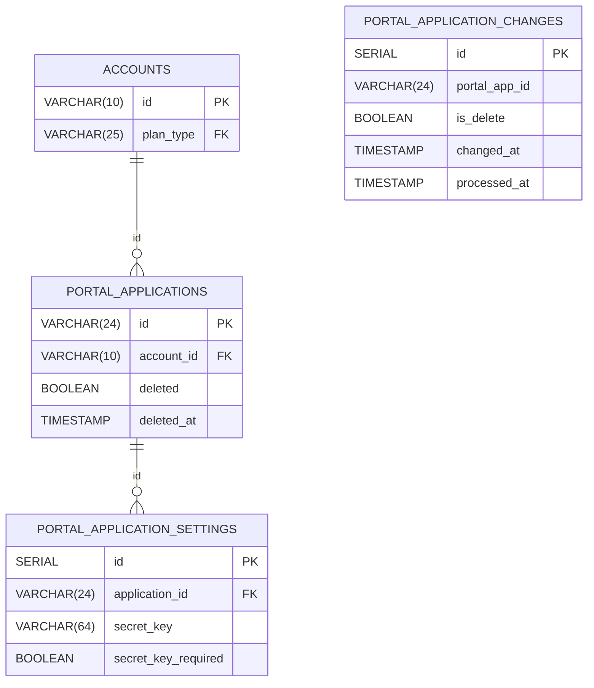

<h1>PEAS Grove Portal Database Compatibility</h1>

 

# Table of Contents <!-- omit in toc -->

- [Grove Postgres Database Schema](#grove-postgres-database-schema)
    - [Entity Relationship Diagram](#entity-relationship-diagram)
- [SQLC Autogeneration](#sqlc-autogeneration)

 

# Grove Postgres Database Schema

<a href="https://www.postgresql.org/">

https://www.postgresql.org/

</a>

 

The [Grove Postgres Driver schema file](https://github.com/buildwithgrove/path-auth-data-server/blob/main/postgres/grove/sqlc/grove_schema.sql)
uses a subset of tables from the existing Grove Portal database schema, allowing `PATH` to source its authorization data from the existing Grove Portal database.

It converts the data stored in the `portal_applications` table and its associated tables into the `PortalApp` format expected by `PEAS`.

It also listens for updates to the Grove Portal DB and streams updates to `PEAS` in real time as changes are made to the connected Postgres database.

### Entity Relationship Diagram

This ERD shows the subset of tables from the full Grove Portal DB schema that are used by the Grove Postgres Driver in PEAS.

# SQLC Autogeneration

<a href="https://docs.sqlc.dev/en/stable">

https://docs.sqlc.dev/en/stable

</a>

 

The Postgres Driver uses `SQLC` to autogenerate the Postgres Go code needed to interact with the Postgres database/

The Make target `make gen_sqlc` will regenerate the Go code from the SQLC schema file.

This will output code autogenerated from the [postgres/grove/sqlc/grove_schema.sql](https://github.com/buildwithgrove/path-auth-data-server/blob/main/postgres/grove/sqlc/grove_schema.sql)
and [postgres/grove/sqlc/grove_queries.sql](https://github.com/buildwithgrove/path-auth-data-server/blob/main/postgres/grove/sqlc/grove_queries.sql) files
to the [postgres/grove/sqlc](https://github.com/buildwithgrove/path-auth-data-server/blob/main/postgres/grove/sqlc) directory.

`SQLC` configuration is defined in the [postgres/sqlc/sqlc.yaml](https://github.com/buildwithgrove/path-auth-data-server/blob/main/postgres/grove/sqlc/sqlc.yaml) file.
